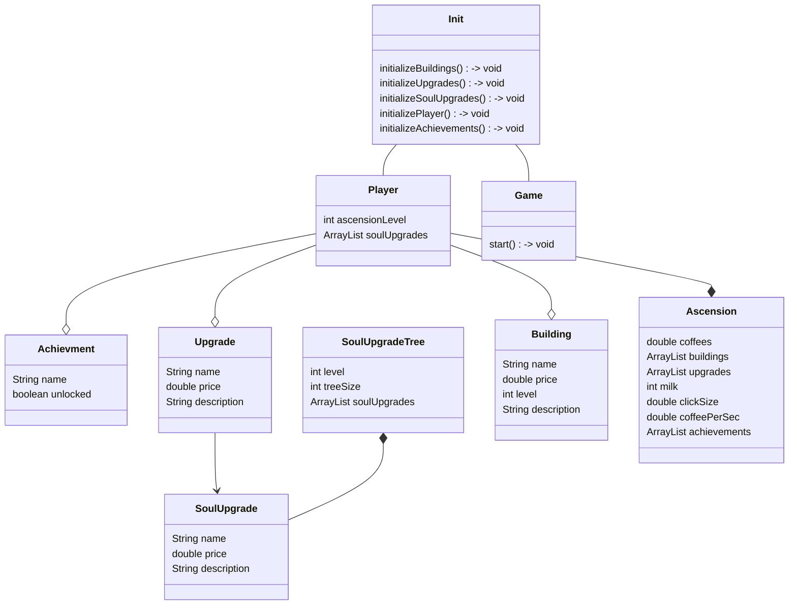

# Insper Clicker

```mermaid
classDiagram
Achievment : String name
Achievment : boolean unlocked

Upgrade : String name
Upgrade : double price
Upgrade : String description

SoulUpgrade : String name
SoulUpgrade : double price
SoulUpgrade : String description

SoulUpgradeTree : int level
SoulUpgradeTree : int treeSize
SoulUpgradeTree : ArrayList<SoulUpgrade> soulUpgrades

Building : String name
Building : double price
Building : int level
Building : String description

Ascension : double coffees
Ascension : ArrayList<Building> buildings
Ascension : ArrayList<Upgrade> upgrades
Ascension : int milk
Ascension : double clickSize
Ascension : double coffeePerSec
Ascension : ArrayList<Achievement> achievements

Player : int ascensionLevel
Player : ArrayList<SoulUpgrade> soulUpgrades

Game : start() -> void

Init : initializeBuildings() -> void
Init : initializeUpgrades() -> void
Init : initializeSoulUpgrades() -> void
Init : initializePlayer() -> void
Init : initializeAchievements() -> void

Init -- Player
Init -- Game
Player --o Achievment
Player --* Ascension
Player --o Upgrade
Player --o Building
Upgrade --> SoulUpgrade
SoulUpgradeTree *-- SoulUpgrade

```
